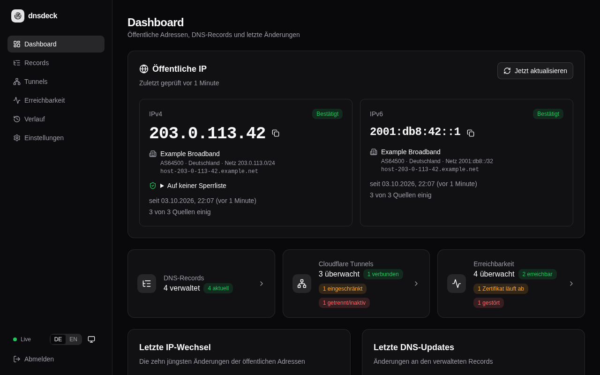
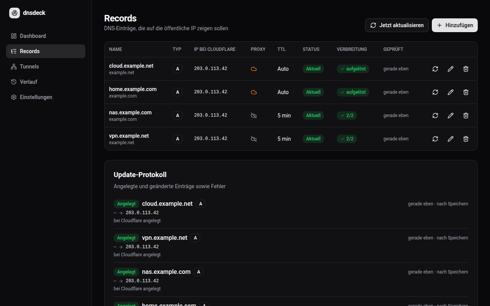
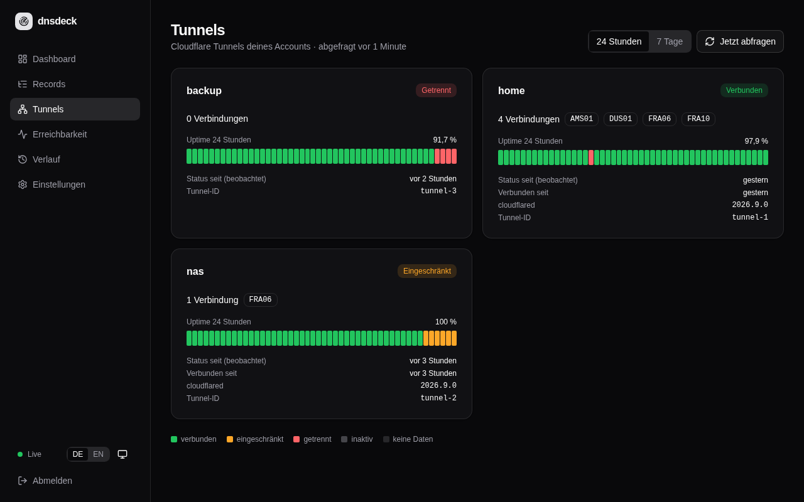
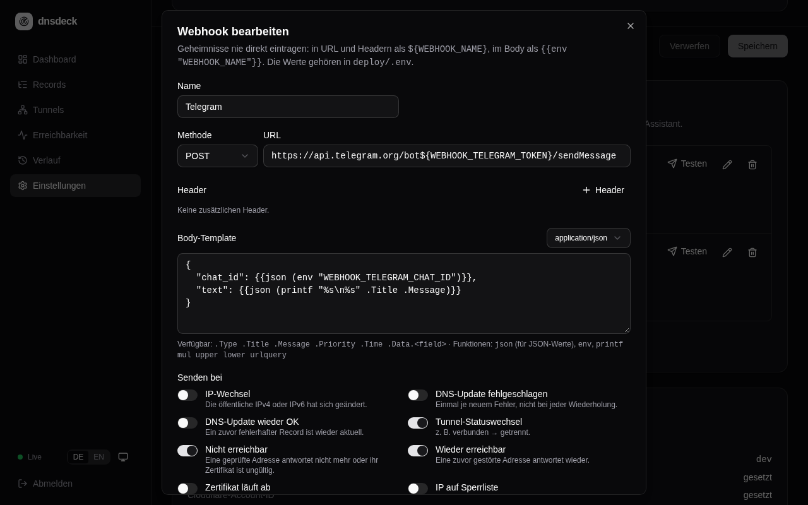

<div align="center">

# dnsdeck

**Selbst gehostetes DynDNS für Cloudflare – mit Live-Dashboard und Cloudflare-Tunnel-Monitoring.**

[](https://github.com/mrcdlm/dnsdeck/actions/workflows/ci.yml)
[](https://github.com/mrcdlm/dnsdeck/releases)
[](LICENSE)

[English](README.md) · Deutsch



</div>

dnsdeck hält DNS-Einträge bei Cloudflare automatisch auf der aktuellen öffentlichen
IP-Adresse, zeigt nachvollziehbar, was sich wann geändert hat, und überwacht Cloudflare
Tunnels. Ausgeliefert wird ein einzelner, kleiner Container (≈ 30 MB, amd64 und arm64) mit
eingebauter Weboberfläche und SQLite-Datenbank.

## Funktionen

- **Zuverlässige IP-Erkennung** – IPv4 und IPv6 über mehrere unabhängige Quellen; eine neue
  Adresse gilt erst, wenn die Mehrheit der Quellen übereinstimmt. Eine einzelne fehlerhafte
  Quelle löst so nie ein DNS-Update aus.
- **DynDNS für Cloudflare** – A- und AAAA-Einträge verwalten (Proxy-Status, TTL). Geändert
  wird nur, wenn der tatsächliche Stand bei Cloudflare abweicht; fehlende Einträge werden
  angelegt.
- **DNS-Verbreitungsstatus** – nach jeder Änderung fragt dnsdeck öffentliche Resolver
  (Cloudflare, Google, Quad9, OpenDNS) und die autoritativen Nameserver der Zone, ob sie die
  neue Adresse schon liefern, und zeigt je Eintrag, wie weit die Änderung verbreitet ist.
- **Cloudflare-Tunnel-Monitoring** – Status, aktive Verbindungen, Rechenzentren,
  Client-Versionen und Uptime über 24 Stunden bzw. 7 Tage je Tunnel.
- **Live-Dashboard** – aktualisiert sich sofort per Server-Sent Events, mobil nutzbar; heller
  und dunkler Modus nach Systemeinstellung; Deutsch und Englisch.
- **Verlauf** – IP-Wechsel, DNS-Updates und Tunnel-Statuswechsel, filterbar.
- **Benachrichtigungen per Webhook** – beliebig viele Webhooks mit eigener Methode, URL,
  eigenen Headern und Body-Template. Vorlagen für ntfy, Gotify, Discord, Slack, Telegram und
  Home Assistant.
- **Sicher voreingestellt** – läuft ohne Root-Rechte auf einem Distroless-Image; Geheimnisse
  nur per Umgebungsvariable; Login mit einem Passwort und Schutz vor Brute-Force-Versuchen.

| Records | Tunnels | Webhooks |
|---|---|---|
|  |  |  |

## Schnellstart

Voraussetzungen: Docker mit Compose-Plugin und ein Cloudflare-API-Token
([benötigte Rechte](#cloudflare-api-token)).

```sh
mkdir dnsdeck && cd dnsdeck
curl -fsSLO https://raw.githubusercontent.com/mrcdlm/dnsdeck/main/deploy/docker-compose.yml
curl -fsSL  https://raw.githubusercontent.com/mrcdlm/dnsdeck/main/deploy/.env.example -o .env
chmod 600 .env
nano .env                                   # APP_PASSWORD und CF_API_TOKEN setzen

mkdir -p data && sudo chown 65532:65532 data   # der Container läuft als UID 65532
docker compose pull && docker compose up -d
docker compose ps                           # nach etwa 30 Sekunden „healthy“
```

Danach `http://<host>:8080` öffnen, mit `APP_PASSWORD` anmelden und unter **Records** die
gewünschten Einträge hinzufügen.

Die Daten liegen standardmäßig in `./data` neben der Compose-Datei. Für einen anderen Ort
`./data` in der `docker-compose.yml` durch einen absoluten Pfad ersetzen (z. B.
`/srv/dnsdeck`) und das Verzeichnis ebenfalls UID 65532 übergeben.

## Konfiguration

Die Konfiguration erfolgt über Umgebungsvariablen in `.env`
(Vorlage: [`deploy/.env.example`](deploy/.env.example)). Laufzeit-Einstellungen wie
Intervalle, IP-Quellen und Webhooks werden in der Weboberfläche gepflegt.

| Variable | Pflicht | Beschreibung |
|---|---|---|
| `APP_PASSWORD` | ja | Passwort für die Weboberfläche (Klartext oder bcrypt-Hash, max. 72 Bytes) |
| `CF_API_TOKEN` | für DNS/Tunnels | Cloudflare-API-Token, siehe unten |
| `CF_ACCOUNT_ID` | für Tunnels | Cloudflare-Account-ID |
| `DNSDECK_VERSION` | ja (Compose) | Zu startende Image-Version, z. B. `0.2.1` – bewusst fest, kein `latest` |
| `DNSDECK_PORT` | nein | Port auf dem Host für die Weboberfläche (Standard `8080`) |
| `TZ` | nein | Zeitzone für Log-Zeitstempel (Standard `UTC`) |
| `WEBHOOK_*` | nein | Geheimnisse für Webhooks, siehe [Benachrichtigungen](#benachrichtigungen) |
| `DNSCHECK_RESOLVERS` | nein | Resolver für die Verbreitungsprüfung, kommagetrennt `[Name=]IP[:Port]`; leer = Standardliste, `off` = abgeschaltet, siehe [DNS-Verbreitung](#dns-verbreitung) |
| `DNSCHECK_AUTHORITATIVE` | nein | `off` = autoritative Nameserver der Zone nicht abfragen (Standard `on`) |
| `LOG_LEVEL` | nein | `debug`, `info`, `warn` oder `error` (Standard `info`) |
| `PORT`, `DATA_DIR` | nein | Port und Datenbankverzeichnis im Container (Standard `8080`, `/data`) |

### Cloudflare-API-Token

Unter *Mein Profil → API-Token* ein benutzerdefiniertes Token mit diesen Rechten anlegen:

| Typ | Berechtigung | Stufe | Wofür |
|---|---|---|---|
| Zone | DNS | Bearbeiten | Einträge aktualisieren |
| Zone | Zone | Lesen | Zonen auflisten |
| Konto | Cloudflare Tunnel | Lesen | Tunnel-Monitoring (optional) |

*Zonen-* und *Kontoressourcen* auf das beschränken, was dnsdeck verwalten soll. **Keine**
*IP-Adressfilterung* verwenden – das Token würde sich nach einem IP-Wechsel selbst aussperren.

## Funktionsweise

- **IP-Erkennung:** In jedem Intervall (Standard 5 Minuten) fragt dnsdeck alle aktivierten
  Quellen parallel ab. Eine Adresse gilt, wenn sie eine gültige öffentliche Adresse ist und
  eine echte Mehrheit (mindestens zwei Quellen) übereinstimmt. Antwortet nur eine Quelle,
  wird ein Wechsel nicht übernommen (nur die allererste Erkennung).
- **DNS-Updates:** Für jeden Eintrag liest dnsdeck den aktuellen Stand bei Cloudflare und
  schreibt nur bei Abweichungen. Die IP wird immer durchgesetzt; bei Proxy-Status und TTL hat
  Cloudflare das letzte Wort – dnsdeck überträgt sie nur, wenn sie in dnsdeck geändert
  wurden. Bestehende Einträge werden mit ihren aktuellen Cloudflare-Werten übernommen.
- **DNS-Verbreitung:** siehe [unten](#dns-verbreitung).
- **Entfernen** eines Eintrags in dnsdeck beendet nur die Verwaltung; der Eintrag bei
  Cloudflare bleibt bestehen.
- **Tunnels** werden standardmäßig alle 60 Sekunden abgefragt. dnsdeck speichert Zeiträume
  gleichen Status (30 Tage Verlauf); Zeiten ohne Daten – etwa während dnsdeck offline war –
  erscheinen als unbekannt und zählen nicht als Uptime. `degraded` gilt als erreichbar.

## DNS-Verbreitung

Nach dem Anlegen oder Ändern eines Eintrags prüft dnsdeck, ob die Änderung im DNS angekommen
ist: 10 Sekunden nach der Änderung und danach alle 30 Sekunden, bis alle Server den neuen
Stand liefern – höchstens für die TTL des Eintrags plus zwei Minuten (automatische TTL zählt
als 5 Minuten, nie länger als eine Stunde). Die Spalte **Verbreitung** auf der Seite Records
zeigt das Ergebnis; ein Klick öffnet die Antwort jedes Servers mit der verbleibenden
Cache-Zeit, **Jetzt prüfen** wiederholt die Prüfung jederzeit.

- **Öffentliche Resolver** (Standard: Cloudflare `1.1.1.1`, Google `8.8.8.8`, Quad9
  `9.9.9.9`, OpenDNS `208.67.222.222`) antworten aus ihrem Cache und zeigen, was Clients
  gerade sehen.
- **Autoritative Nameserver** der Zone werden direkt gefragt und zeigen den aktuellen Stand
  bei Cloudflare.
- **Proxied Einträge** lösen auf Cloudflare-Adressen auf; geprüft wird daher nur die
  Auflösbarkeit.
- Server ohne Antwort werden angezeigt, zählen aber nicht gegen das Ergebnis.

Die Prüfung sendet nur DNS-Anfragen für die verwalteten Namen (UDP/TCP Port 53). Mit
`DNSCHECK_RESOLVERS` lassen sich andere Resolver wählen, z. B.
`DNSCHECK_RESOLVERS=Quad9=9.9.9.9,Lokal=192.168.1.1:53`; `DNSCHECK_RESOLVERS=off` schaltet die
Funktion ab.

## Sprache und Darstellung

Die Weboberfläche gibt es auf Deutsch und Englisch. Sie folgt der Browsersprache und lässt
sich mit **DE | EN** in der Seitenleiste oder auf der Anmeldeseite umschalten; die Wahl
merkt sich der Browser. Server-Meldungen (Fehler, Record-Status, Update-Protokoll) folgen der
gewählten Sprache; Einträge aus Versionen vor 0.2.0 werden beim Start nach Möglichkeit
umgewandelt. Die Sprache der Benachrichtigungen ist eine eigene Einstellung unter **Einstellungen**
(Standard Deutsch).

Der Darstellungs-Button daneben wechselt zwischen **System** (Standard, folgt live dem
Betriebssystem), **Hell** und **Dunkel**.

## Benachrichtigungen

Benachrichtigungen laufen über Webhooks, die unter **Einstellungen** angelegt werden. Jeder
Webhook hat eigene Methode, URL, Header, ein Body-Template und eine eigene Ereignisauswahl:

- IP-Adresse geändert
- DNS-Update fehlgeschlagen (einmal je neuem Fehler, nicht bei jeder Wiederholung)
- DNS-Update wieder erfolgreich
- Tunnel-Status geändert

Der Body ist ein Go-[`text/template`](https://pkg.go.dev/text/template) mit den Feldern
`.Type`, `.Title`, `.Message`, `.Priority`, `.Time` und `.Data.<feld>` sowie den Funktionen
`json`, `env`, `printf`, `mul`, `upper`, `lower` und `urlquery`. Ein leeres Template sendet
das Ereignis als JSON. Der Dialog zeigt eine Live-Vorschau, und jeder Webhook kann eine
Testnachricht senden.

**Geheimnisse gehören nie in die Konfiguration.** Sie kommen mit dem Präfix `WEBHOOK_` in die
`.env` und werden als `${WEBHOOK_NAME}` in URL oder Headern bzw. `{{env "WEBHOOK_NAME"}}` im
Body referenziert. Nur Variablen mit diesem Präfix sind erreichbar, Platzhalter in
Ereignisdaten werden nie ersetzt, und offensichtlich im Klartext eingetragene Geheimnisse
(etwa `Authorization`-Header oder Discord-/Slack-/Telegram-URLs) werden abgelehnt.

```sh
# .env
WEBHOOK_TELEGRAM_TOKEN=123456:ABC-dein-bot-token
WEBHOOK_TELEGRAM_CHAT_ID=123456789
```

## Aktualisieren

dnsdeck folgt [Semantic Versioning](https://semver.org). Die
[Release Notes](https://github.com/mrcdlm/dnsdeck/releases) lesen, `DNSDECK_VERSION` in
`.env` auf die neue Version setzen und ausführen:

```sh
docker compose pull && docker compose up -d
```

Für ein Rollback die vorherige Version eintragen und denselben Befehl ausführen.
Datenbank-Migrationen laufen beim Start automatisch; vor größeren Updates das
Datenverzeichnis sichern.

## Sicherheit

- Die Weboberfläche spricht nur HTTP. **Port 8080 nicht ins Internet freigeben.** Stattdessen
  über einen Reverse Proxy mit TLS oder einen Cloudflare Tunnel veröffentlichen, idealerweise
  geschützt durch Cloudflare Access.
- Hinter einem Proxy mit TLS wird das Session-Cookie automatisch als `Secure` markiert
  (`X-Forwarded-Proto: https`).
- Geheimnisse werden ausschließlich aus Umgebungsvariablen gelesen und nie in Datenbank,
  Logs oder API-Antworten geschrieben.

Sicherheitslücken bitte wie in [SECURITY.md](SECURITY.md) beschrieben melden.

## Entwicklung

Voraussetzungen: Go 1.27, Node.js 24.

```sh
# Backend (zeigt eine Platzhalterseite, bis das Frontend gebaut ist)
APP_PASSWORD=test DATA_DIR=./data go run ./cmd/server

# Frontend mit Hot Reload (leitet API-Anfragen an :8080 weiter)
cd web && npm install && npm run dev
```

Ohne echten Cloudflare-Account mit der mitgelieferten API-Nachbildung arbeiten – echte
DNS-Einträge bleiben unberührt:

```sh
go run ./cmd/cfmock -token dev -zones example.com -account dev-account -tunnels home:healthy,nas:degraded
CF_API_TOKEN=dev CF_ACCOUNT_ID=dev-account CF_API_BASE_URL=http://localhost:8787 \
  APP_PASSWORD=test DATA_DIR=./data go run ./cmd/server

curl -X POST 'localhost:8787/_tunnel?name=home&status=down'   # Tunnel-Status ändern
curl -X POST 'localhost:8787/_fail?status=500'                # Ausfall simulieren (0 = Ende)
```

Die Nachbildung beantwortet auf Wunsch auch DNS-Anfragen für ihre Einträge, zum Testen der
Verbreitungsprüfung (`-dns-lagged` liefert den Stand von vor `-dns-lag`, wie ein
Resolver-Cache):

```sh
go run ./cmd/cfmock -token dev -zones example.com -dns 127.0.0.1:8553 -dns-lagged 127.0.0.1:8554 -dns-lag 30s
DNSCHECK_RESOLVERS='Aktuell=127.0.0.1:8553,Verzögert=127.0.0.1:8554' DNSCHECK_AUTHORITATIVE=off … go run ./cmd/server
```

Prüfungen (laufen alle auch in der CI):

```sh
go vet ./... && go test ./...
cd web && npm run lint && npm run build
cd e2e && npm ci && npx playwright install chromium && npx playwright test
```

Einen lokal gebauten Container starten: `cd deploy && docker compose -f docker-compose.dev.yml up -d --build`.

## Releases

Ein Tag `vX.Y.Z` baut Multi-Arch-Images (`linux/amd64`, `linux/arm64`) und veröffentlicht
sie unter `ghcr.io/mrcdlm/dnsdeck` als `X.Y.Z`, `X.Y` und `latest` (ab 1.0 zusätzlich `X`),
zusammen mit einem GitHub-Release. Jeder Push auf `main` veröffentlicht `main`. Änderungen
stehen im [Changelog](CHANGELOG.md).

## Lizenz

[MIT](LICENSE)
