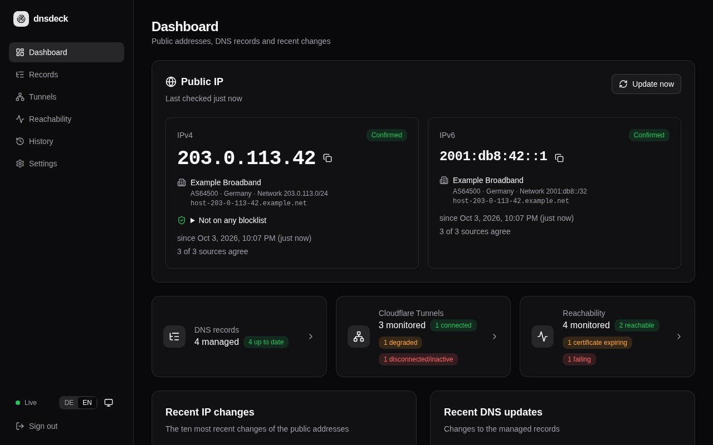
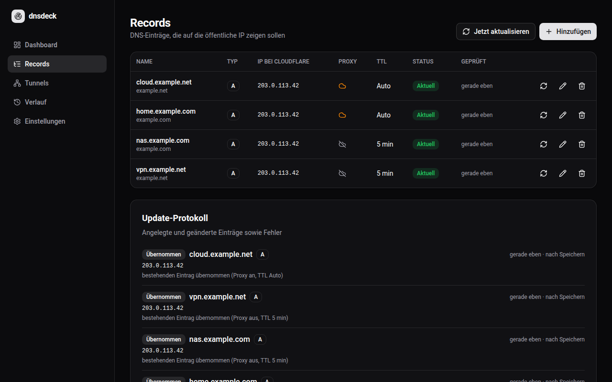
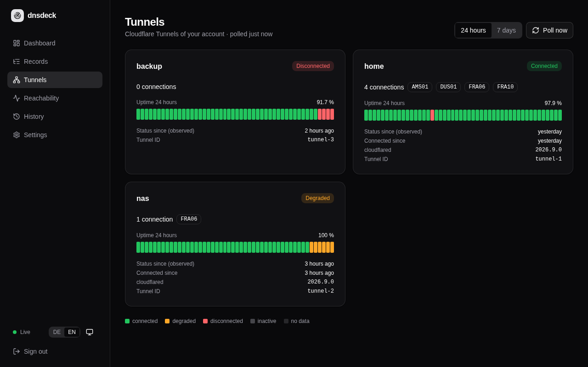
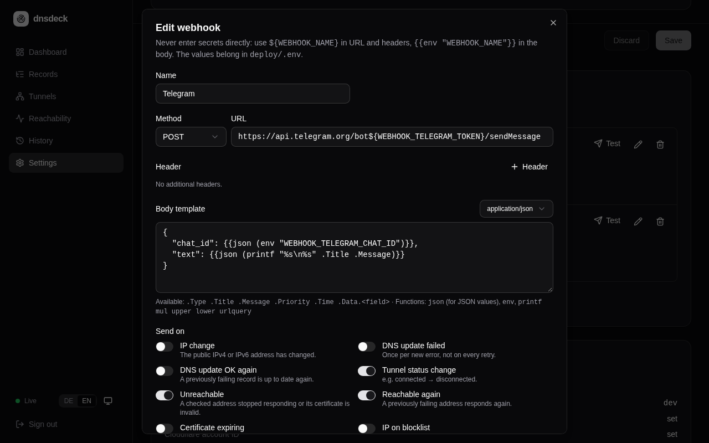

<div align="center">

# dnsdeck

**Self-hosted dynamic DNS for Cloudflare – with a live dashboard and Cloudflare Tunnel monitoring.**

[](https://github.com/mrcdlm/dnsdeck/actions/workflows/ci.yml)
[](https://github.com/mrcdlm/dnsdeck/releases)
[](LICENSE)

English · [Deutsch](README.de.md)



</div>

dnsdeck keeps your Cloudflare DNS records pointed at your current public IP address, shows
what changed and when, and watches your Cloudflare Tunnels. It ships as a single small
container (≈ 30 MB, amd64 and arm64) with an embedded web interface and an SQLite database.

## Features

- **Reliable IP detection** – IPv4 and IPv6 from several independent sources; a new address
  is only accepted when the majority of sources agree, so a single faulty source never
  triggers a DNS update.
- **Provider display** – for each public address the dashboard shows your internet provider
  (autonomous system with number, country and network) and the reverse DNS name.
- **Dynamic DNS for Cloudflare** – manage A and AAAA records (proxy status, TTL). Records are
  only changed when the actual state at Cloudflare differs; missing records are created.
- **DNS propagation status** – after every change dnsdeck asks public resolvers (Cloudflare,
  Google, Quad9, OpenDNS) and the zone's authoritative name servers whether they already
  return the new address, and shows per record how far the change has spread.
- **Cloudflare Tunnel monitoring** – status, active connections, data centers, client
  versions and 24 h / 7 day uptime per tunnel.
- **Reachability and certificates** – checks your own services over HTTP(S) (per record with
  one switch, or any URL), reports outages and warns before TLS certificates expire.
- **Live dashboard** – updates instantly via Server-Sent Events, works on mobile; light and
  dark mode following the system setting; English and German.
- **Blocklist check** – shows whether your public IPv4 is on a spam blocklist (Spamhaus,
  SpamCop and others) and notifies you of new listings – useful for self-hosted mail.
- **Installable app** – add dnsdeck to your phone's home screen or install it as a desktop
  app (PWA); the interface also opens without a connection.
- **History** – IP changes, DNS updates and tunnel status changes, filterable.
- **Notifications via webhooks** – any number of webhooks with custom method, URL, headers
  and body template. Templates included for ntfy, Gotify, Discord, Slack, Telegram and
  Home Assistant.
- **Secure by default** – runs as non-root on a distroless image; secrets only via
  environment variables; single-password login with rate limiting.

| Records | Tunnels | Webhooks |
|---|---|---|
|  |  |  |

## Quick start

Requirements: Docker with the Compose plugin, a Cloudflare API token
([permissions](#cloudflare-api-token)).

```sh
mkdir dnsdeck && cd dnsdeck
curl -fsSLO https://raw.githubusercontent.com/mrcdlm/dnsdeck/main/deploy/docker-compose.yml
curl -fsSL  https://raw.githubusercontent.com/mrcdlm/dnsdeck/main/deploy/.env.example -o .env
chmod 600 .env
nano .env                                   # set APP_PASSWORD and CF_API_TOKEN

mkdir -p data && sudo chown 65532:65532 data   # the container runs as UID 65532
docker compose pull && docker compose up -d
docker compose ps                           # "healthy" after about 30 seconds
```

Open `http://<host>:8080`, sign in with `APP_PASSWORD` and add your records under **Records**.

The data directory defaults to `./data` next to the Compose file. To use another location,
replace `./data` in `docker-compose.yml` with an absolute path (for example `/srv/dnsdeck`)
and give that directory to UID 65532 as well.

## Configuration

All configuration is done through environment variables in `.env`
(template: [`deploy/.env.example`](deploy/.env.example)). Runtime settings such as
intervals, IP sources and webhooks are managed in the web interface.

| Variable | Required | Description |
|---|---|---|
| `APP_PASSWORD` | yes | Password for the web interface (plain text or bcrypt hash, max. 72 bytes) |
| `CF_API_TOKEN` | for DNS / tunnels | Cloudflare API token, see below |
| `CF_ACCOUNT_ID` | for tunnels | Cloudflare account ID |
| `DNSDECK_VERSION` | yes (Compose) | Image version to run, e.g. `0.3.1` – pinned on purpose, no `latest` |
| `DNSDECK_PORT` | no | Host port for the web interface (default `8080`) |
| `TZ` | no | Time zone for log timestamps (default `UTC`) |
| `WEBHOOK_*` | no | Secrets referenced by webhooks, see [Notifications](#notifications) |
| `DNSCHECK_RESOLVERS` | no | Resolvers for the propagation check, comma-separated `[Name=]IP[:port]`; empty = default list, `off` = disabled, see [DNS propagation](#dns-propagation) |
| `DNSCHECK_AUTHORITATIVE` | no | `off` = do not query the zone's authoritative name servers (default `on`) |
| `ISP_LOOKUP` | no | `off` = do not look up the provider of the public IPs (default `on`), see [How it works](#how-it-works) |
| `DNSBL_LISTS` | no | Blocklists for the public IPv4, comma-separated `[Name=]zone`; empty = default list, `off` = disabled, see [How it works](#how-it-works) |
| `LOG_LEVEL` | no | `debug`, `info`, `warn` or `error` (default `info`) |
| `PORT`, `DATA_DIR` | no | Port and database directory inside the container (default `8080`, `/data`) |

### Cloudflare API token

Create a custom token under *My Profile → API Tokens* with these permissions:

| Type | Permission | Access | Needed for |
|---|---|---|---|
| Zone | DNS | Edit | updating records |
| Zone | Zone | Read | listing your zones |
| Account | Cloudflare Tunnel | Read | tunnel monitoring (optional) |

Restrict *Zone Resources* and *Account Resources* to what dnsdeck should manage. Do **not**
use *Client IP Address Filtering* – the token would lock itself out after your IP changes.

## How it works

- **IP detection:** every interval (default 5 minutes) dnsdeck queries all enabled sources in
  parallel. An address is accepted when it is a valid public address and a strict majority
  (at least two sources) agrees. If only one source answers, a change is not accepted
  (only the very first detection is).
- **Provider:** for the confirmed address dnsdeck asks
  [Team Cymru's IP-to-ASN service](https://www.team-cymru.com/ip-asn-mapping) via DNS (network,
  AS number and name, country) and looks up the reverse DNS name – no API key, using the
  container's resolver. The result is kept for 24 hours or until the next IP change. This sends
  your public address to Team Cymru; `ISP_LOOKUP=off` disables the lookup.
- **Blocklists:** the confirmed IPv4 is checked against DNS blocklists that mail servers consult
  before accepting email: Spamhaus ZEN, SpamCop, PSBL and Mailspike. This matters if you run
  your own mail server. Spamhaus *PBL* lists almost every residential connection and is shown
  as information, not as a listing. Spamhaus refuses queries sent through public resolvers such
  as 1.1.1.1 or 8.8.8.8 – the result is then “could not be checked”; let the container use your
  router's or provider's resolver. Checked again after every IP change and every 24 hours;
  `DNSBL_LISTS=off` disables it.
- **DNS updates:** for each record dnsdeck reads the current state from Cloudflare and only
  writes when something differs. The IP is always enforced; for proxy status and TTL the value
  at Cloudflare wins – dnsdeck only pushes them when you change them in dnsdeck. Existing
  records are adopted with their current Cloudflare settings.
- **DNS propagation:** see [below](#dns-propagation).
- **Removing a record** in dnsdeck only stops managing it; the record at Cloudflare stays.
- **Tunnels** are polled every 60 seconds by default. dnsdeck stores periods of equal status (30 days of
  history); times without data – for example while dnsdeck was offline – are shown as unknown
  instead of being counted as uptime. `degraded` counts as available.
- **Reachability:** see [below](#reachability-and-certificates).

## DNS propagation

After a record has been created or changed, dnsdeck checks whether the change has reached the
DNS: 10 seconds after the change and then every 30 seconds until all servers return the new
state – at most for the record's TTL plus two minutes (automatic TTL counts as 5 minutes,
never longer than an hour). The **Propagation** column on the records page shows the result;
a click opens the answer of every server with its remaining cache time, and **Check now**
repeats the check at any time.

- **Public resolvers** (default: Cloudflare `1.1.1.1`, Google `8.8.8.8`, Quad9 `9.9.9.9`,
  OpenDNS `208.67.222.222`) answer from their cache and show what clients currently see.
- **Authoritative name servers** of the zone are queried directly and show the current state
  at Cloudflare.
- **Proxied records** resolve to Cloudflare addresses, so only resolvability is checked.
- Servers that do not answer are shown but do not count against the result.

The check only sends DNS queries for your managed record names (UDP/TCP port 53). Use
`DNSCHECK_RESOLVERS` to choose other resolvers, for example
`DNSCHECK_RESOLVERS=Quad9=9.9.9.9,Local=192.168.1.1:53`, or `DNSCHECK_RESOLVERS=off` to disable
the feature.

## Reachability and certificates

Under **Reachability** dnsdeck checks whether your services respond – for a record simply turn
on **Check reachability** in its dialog (checks `https://<name>/`), or add any `http://` or
`https://` URL, including internal ones.

- Every 5 minutes by default (**Settings**), dnsdeck sends a `GET` request without following
  redirects. Any response below 500 counts as reachable – a redirect or login page too.
- A service only counts as unreachable after **two failures in a row**, so short hiccups do not
  trigger notifications.
- The TLS certificate is checked on every request: validity, host name, trusted issuer and
  remaining lifetime. dnsdeck warns once per certificate when it expires within 14 days
  (configurable); an invalid certificate counts as an outage.
- Checks run from inside the container. Addresses **not** routed through Cloudflare (DNS only)
  can be unreachable from your own network even though they work from outside, if your router
  lacks NAT loopback (hairpin NAT). Proxied records and tunnel hostnames are not affected.

## Languages and appearance

The web interface is available in English and German. It follows the browser language and
can be switched with **EN | DE** in the sidebar or on the login page; the choice is stored in
the browser. Server messages (errors, record status, update log) follow the chosen language;
entries written by versions before 0.2.0 are converted on start where possible. The language of
notifications is a separate setting under **Settings** (default German).

The theme button next to it switches between **System** (default, follows the operating
system live), **Light** and **Dark**.

### Install as an app

dnsdeck is a progressive web app: in Chrome/Edge use **Install app** in the address bar, on
Android **Add to home screen**, in Safari on iOS **Share → Add to Home Screen**. It then opens
in its own window without browser bars. Browsers only offer this over **HTTPS** (e.g. behind a
reverse proxy or a Cloudflare Tunnel) or on `localhost`. Only the interface itself is cached
for offline use – data from `/api` is never stored by the service worker.

## Notifications

Notifications are sent through webhooks, configured under **Settings**. Each webhook has its
own method, URL, headers, body template and event selection:

- IP address changed
- DNS update failed (once per new error, not on every retry)
- DNS update recovered
- Tunnel status changed
- Service unreachable or certificate invalid / reachable again (`.Data.url`, `.Data.host`,
  `.Data.status`, `.Data.http_status`, `.Data.error`)
- Certificate expiring (`.Data.url`, `.Data.host`, `.Data.not_after`, `.Data.days`, `.Data.issuer`)
- Public IPv4 newly found on a blocklist (`.Data.ip`, `.Data.lists`, `.Data.zones`)

The body is a Go [`text/template`](https://pkg.go.dev/text/template) with the fields
`.Type`, `.Title`, `.Message`, `.Priority`, `.Time` and `.Data.<field>`, and the functions
`json`, `env`, `printf`, `mul`, `upper`, `lower` and `urlquery`. An empty template sends the
event as JSON. The dialog shows a live preview and every webhook can send a test message.

**Secrets never go into the configuration.** Put them into `.env` with the prefix `WEBHOOK_`
and reference them as `${WEBHOOK_NAME}` in the URL or headers, or `{{env "WEBHOOK_NAME"}}` in
the body. Only variables with this prefix can be referenced, placeholders inside event data
are never expanded, and obvious plain-text secrets (such as `Authorization` headers or
Discord/Slack/Telegram URLs) are rejected.

```sh
# .env
WEBHOOK_TELEGRAM_TOKEN=123456:ABC-your-bot-token
WEBHOOK_TELEGRAM_CHAT_ID=123456789
```

## Updating

dnsdeck follows [semantic versioning](https://semver.org). Read the
[release notes](https://github.com/mrcdlm/dnsdeck/releases), set `DNSDECK_VERSION` in `.env`
to the new version and run:

```sh
docker compose pull && docker compose up -d
```

To roll back, set the previous version and run the same command. Database migrations are
applied automatically on start; back up the data directory before major updates.

## Security

- The web interface uses plain HTTP. **Do not expose port 8080 to the internet.** Publish it
  through a reverse proxy with TLS or a Cloudflare Tunnel, ideally protected by
  Cloudflare Access.
- Behind a TLS-terminating proxy the session cookie is marked `Secure` automatically
  (`X-Forwarded-Proto: https`).
- Secrets are read from environment variables only and are never written to the database,
  logs or API responses.

Please report vulnerabilities as described in [SECURITY.md](SECURITY.md).

## Development

Requirements: Go 1.27, Node.js 24.

```sh
# Backend (serves a placeholder page until the frontend is built)
APP_PASSWORD=test DATA_DIR=./data go run ./cmd/server

# Frontend with hot reload (proxies API requests to :8080)
cd web && npm install && npm run dev
```

Work without a real Cloudflare account using the bundled API mock – no real DNS records
are touched:

```sh
go run ./cmd/cfmock -token dev -zones example.com -account dev-account -tunnels home:healthy,nas:degraded
CF_API_TOKEN=dev CF_ACCOUNT_ID=dev-account CF_API_BASE_URL=http://localhost:8787 \
  APP_PASSWORD=test DATA_DIR=./data go run ./cmd/server

curl -X POST 'localhost:8787/_tunnel?name=home&status=down'   # change a tunnel status
curl -X POST 'localhost:8787/_fail?status=500'                # simulate an outage (0 = end)
```

The mock can also answer DNS queries for its records, for testing the propagation check
(`-dns-lagged` serves the state from `-dns-lag` ago, like a resolver cache):

```sh
go run ./cmd/cfmock -token dev -zones example.com -dns 127.0.0.1:8553 -dns-lagged 127.0.0.1:8554 -dns-lag 30s
DNSCHECK_RESOLVERS='Current=127.0.0.1:8553,Lagged=127.0.0.1:8554' DNSCHECK_AUTHORITATIVE=off … go run ./cmd/server
```

Checks (all run in CI):

```sh
go vet ./... && go test ./...
cd web && npm run lint && npm run build
cd e2e && npm ci && npx playwright install chromium && npx playwright test
```

To run a locally built container: `cd deploy && docker compose -f docker-compose.dev.yml up -d --build`.

## Releases

Pushing a tag `vX.Y.Z` builds multi-arch images (`linux/amd64`, `linux/arm64`) and publishes
them to `ghcr.io/mrcdlm/dnsdeck` as `X.Y.Z`, `X.Y` and `latest` (plus `X` from 1.0 on),
together with a GitHub release. Every push to `main` publishes `main`. Changes are listed in
the [changelog](CHANGELOG.md).

## License

[MIT](LICENSE)
